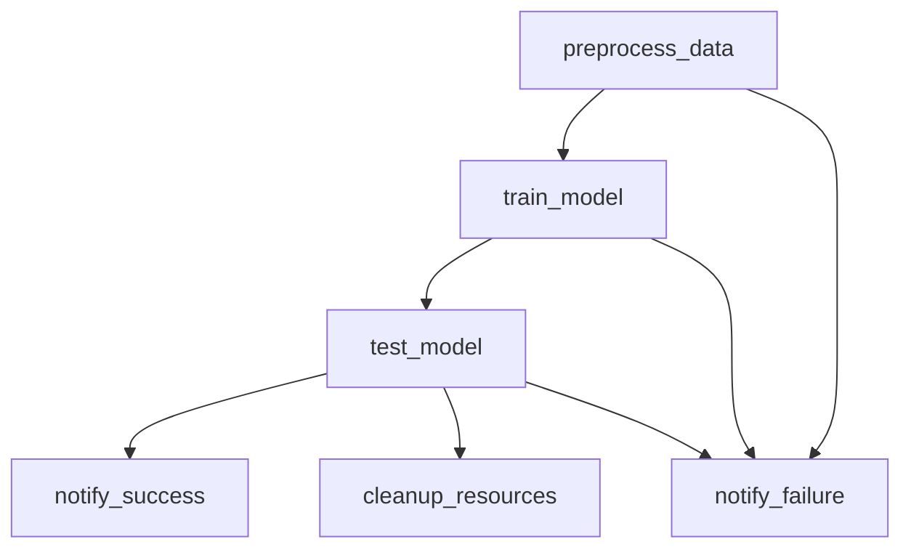

# Apache Airflow Setup Guide for ML Pipeline Automation

## 📋 Table of Contents
1. [What is Apache Airflow?](#what-is-apache-airflow)
2. [Local Development Setup](#local-development-setup)
3. [Understanding Your DAG](#understanding-your-dag)
4. [Testing Your Pipeline](#testing-your-pipeline)
5. [Production Deployment on AWS](#production-deployment-on-aws)
6. [Monitoring and Troubleshooting](#monitoring-and-troubleshooting)
7. [Best Practices](#best-practices)

## What is Apache Airflow?

Apache Airflow is a workflow orchestration platform that allows you to:
- **Define workflows as code** using Python (called DAGs - Directed Acyclic Graphs)
- **Schedule tasks** to run at specific times or intervals
- **Monitor** workflow execution and handle failures
- **Retry** failed tasks automatically
- **Send notifications** on success/failure
- **Manage dependencies** between tasks

### Key Concepts:
- **DAG**: A workflow definition (your ML pipeline)
- **Task**: A single unit of work (preprocess, train, test)
- **Operator**: Defines what a task does (PythonOperator, BashOperator, etc.)
- **Scheduler**: Monitors DAGs and triggers task execution
- **Executor**: Runs the tasks
- **Webserver**: Provides the web UI

## Local Development Setup

### Prerequisites
- Docker and Docker Compose installed
- Your existing ML pipeline code
- AWS credentials configured

### Step 1: Clone and Prepare Your Project

```bash
# Ensure your project structure looks like this:
your-project/
├── modelfactory/
│   ├── preprocess/
│   │   └── preprocess.py
│   ├── train.py
│   └── test.py
├── src/
│   └── app.py
├── dags/
│   └── ml_pipeline_dag.py
├── docker-compose.airflow.yml
├── airflow_requirements.txt
├── setup_airflow.sh
└── .env
```

### Step 2: Run the Setup Script

```bash
# Make the setup script executable
chmod +x setup_airflow.sh

# Run the setup
./setup_airflow.sh
```

### Step 3: Configure Environment Variables

Edit the `.env` file with your actual values:

```bash
# AWS Configuration
AWS_ACCESS_KEY_ID=your-actual-aws-access-key
AWS_SECRET_ACCESS_KEY=your-actual-aws-secret-key
S3_BUCKET_NAME=your-actual-s3-bucket-name
AWS_REGION=us-east-1

# Airflow Web UI Credentials
_AIRFLOW_WWW_USER_USERNAME=admin
_AIRFLOW_WWW_USER_PASSWORD=your-secure-password

# Airflow UID (automatically set by setup script)
AIRFLOW_UID=50000
```

### Step 4: Start Airflow

```bash
# Start all Airflow services
docker-compose -f docker-compose.airflow.yml up -d

# Check that all services are running
docker-compose -f docker-compose.airflow.yml ps
```

### Step 5: Access the Web UI

1. Open your browser and go to: `http://localhost:8080`
2. Login with the credentials from your `.env` file
3. You should see the Airflow dashboard

## Understanding Your DAG

Your ML pipeline DAG (`ml_engagement_prediction_pipeline`) consists of these tasks:



### Task Breakdown:

1. **preprocess_data**: 
   - Loads data from S3
   - Cleans and processes the data
   - Saves processed data back to S3
   - Duration: ~30-60 minutes

2. **train_model**:
   - Loads processed data
   - Trains the CLIP model with LoRA
   - Logs metrics to MLflow
   - Saves the best model to S3
   - Duration: ~2-4 hours

3. **test_model**:
   - Loads test data and trained model
   - Evaluates model performance
   - Logs test results
   - Duration: ~15-30 minutes

4. **cleanup_resources**:
   - Clears GPU memory
   - Cleans temporary files
   - Duration: ~1-2 minutes

5. **notify_success/notify_failure**:
   - Sends email notifications
   - Duration: ~1 minute

### Schedule:
- **Frequency**: Every Monday at 2:00 AM UTC
- **Cron Expression**: `0 2 * * 1`
- **No Catchup**: Won't run missed schedules if Airflow was down

## Testing Your Pipeline

### Step 1: Enable Your DAG

1. In the Airflow UI, find your DAG: `ml_engagement_prediction_pipeline`
2. Click the toggle switch to enable it
3. The DAG should appear in green/active state

### Step 2: Trigger a Manual Run

1. Click on your DAG name to open the DAG details
2. Click the "Trigger DAG" button (play icon)
3. Confirm the trigger

### Step 3: Monitor Execution

1. Watch the task status in the Graph view
2. Click on individual tasks to see logs
3. Check for any errors or warnings

### Step 4: Common Issues and Solutions

**Issue**: Import errors in tasks
```bash
# Solution: Install missing packages
docker-compose -f docker-compose.airflow.yml exec airflow-webserver pip install package-name
```

**Issue**: AWS credentials not working
```bash
# Solution: Check .env file and restart services
docker-compose -f docker-compose.airflow.yml restart
```

**Issue**: Out of memory errors
```bash
# Solution: Increase Docker memory allocation or reduce batch sizes
```

## Production Deployment on AWS

For production, use **AWS MWAA (Managed Workflows for Apache Airflow)** instead of self-hosting.

### Step 1: Prepare Your Code for MWAA

1. Create an S3 bucket for MWAA artifacts:
```bash
aws s3 mb s3://your-mwaa-bucket --region us-east-1
```

2. Upload your files:
```bash
# Create the directory structure
mkdir -p mwaa-deployment/dags
mkdir -p mwaa-deployment/plugins
mkdir -p mwaa-deployment/requirements

# Copy your files
cp dags/ml_pipeline_dag.py mwaa-deployment/dags/
cp airflow_requirements.txt mwaa-deployment/requirements.txt
zip -r plugins.zip plugins/ # if you have custom plugins

# Upload to S3
aws s3 cp mwaa-deployment/dags/ s3://your-mwaa-bucket/dags/ --recursive
aws s3 cp mwaa-deployment/requirements.txt s3://your-mwaa-bucket/
```

### Step 2: Create MWAA Environment

Create a CloudFormation template or use AWS CLI:

```bash
aws mwaa create-environment \
    --name ml-pipeline-airflow \
    --source-bucket-arn arn:aws:s3:::your-mwaa-bucket \
    --dag-s3-path dags/ \
    --requirements-s3-path requirements.txt \
    --execution-role-arn arn:aws:iam::YOUR-ACCOUNT:role/MWAAExecutionRole \
    --network-configuration SubnetIds=subnet-12345,subnet-67890,SecurityGroupIds=sg-abcdef \
    --logging-configuration DagProcessingLogs='{LogLevel=INFO,Enabled=true}',SchedulerLogs='{LogLevel=INFO,Enabled=true}',TaskLogs='{LogLevel=INFO,Enabled=true}',WorkerLogs='{LogLevel=INFO,Enabled=true}',WebserverLogs='{LogLevel=INFO,Enabled=true}' \
    --airflow-version 2.8.1 \
    --environment-class mw1.medium
```

### Step 3: Configure IAM Permissions

Your MWAA execution role needs permissions for:
- S3 (read/write to your data buckets)
- CloudWatch Logs
- EC2 (if using custom networking)

Example IAM policy:
```json
{
    "Version": "2012-10-17",
    "Statement": [
        {
            "Effect": "Allow",
            "Action": [
                "s3:GetObject",
                "s3:PutObject",
                "s3:DeleteObject",
                "s3:ListBucket"
            ],
            "Resource": [
                "arn:aws:s3:::your-data-bucket",
                "arn:aws:s3:::your-data-bucket/*"
            ]
        }
    ]
}
```

### Step 4: Environment Variables in MWAA

Set environment variables in MWAA configuration:
- `S3_BUCKET_NAME`: your-data-bucket
- `AWS_REGION`: us-east-1

### Step 5: Deploy and Test

1. Wait for MWAA environment to be created (~20-30 minutes)
2. Access the Airflow UI through the MWAA console
3. Enable and test your DAG

## Monitoring and Troubleshooting

### Monitoring Tools:

1. **Airflow Web UI**:
   - Task status and logs
   - DAG run history
   - Resource utilization

2. **CloudWatch** (for MWAA):
   - Custom metrics and alarms
   - Log aggregation
   - Performance monitoring

3. **MLflow UI**:
   - Experiment tracking
   - Model metrics comparison
   - Artifact storage

### Setting Up Alerts:

1. **Email Notifications** (already configured in DAG):
   - Success/failure emails
   - SLA violation alerts

2. **Slack Integration**:
```python
from airflow.providers.slack.operators.slack_webhook import SlackWebhookOperator

slack_alert = SlackWebhookOperator(
    task_id='slack_notification',
    http_conn_id='slack_webhook',
    message='ML Pipeline completed successfully!',
    dag=dag
)
```

3. **CloudWatch Alarms** (for MWAA):
```bash
aws cloudwatch put-metric-alarm \
    --alarm-name "MWAA-Task-Failures" \
    --alarm-description "Alert when tasks fail" \
    --metric-name TaskFailures \
    --namespace AWS/MWAA \
    --statistic Sum \
    --period 300 \
    --threshold 1 \
    --comparison-operator GreaterThanOrEqualToThreshold
```

### Common Issues:

1. **Task Timeouts**:
   - Increase `execution_timeout` in task definition
   - Monitor resource usage
   - Consider breaking large tasks into smaller ones

2. **Memory Issues**:
   - Reduce batch sizes in your ML code
   - Use instance types with more memory
   - Implement data streaming/chunking

3. **Dependency Conflicts**:
   - Pin package versions in requirements.txt
   - Use virtual environments
   - Test locally before deploying

## Best Practices

### 1. Code Organization
```python
# Keep tasks idempotent
def preprocess_data(**context):
    # Check if output already exists
    if s3_object_exists('processed/data.pkl'):
        return "data_already_processed"
    # Proceed with processing...
```

### 2. Error Handling
```python
def train_model(**context):
    try:
        # Training logic
        pass
    except Exception as e:
        # Log error details
        logger.error(f"Training failed: {str(e)}")
        # Send custom notification
        send_error_notification(str(e))
        raise
```

### 3. Resource Management
```python
# Use pools to limit concurrent resource-intensive tasks
train_task = PythonOperator(
    task_id='train_model',
    python_callable=train_model,
    pool='gpu_pool',  # Limit GPU usage
    pool_slots=1,
    dag=dag
)
```

### 4. Data Validation
```python
def validate_data(**context):
    # Check data quality before training  
    data = load_data()
    if len(data) < MIN_SAMPLES:
        raise ValueError("Insufficient training data")
    if data.isnull().sum() > MAX_NULL_THRESHOLD:
        raise ValueError("Too many null values")
```

### 5. Version Control
- Store DAGs in Git
- Use tags for model versions
- Implement CI/CD for DAG deployment

### 6. Testing
```python
# Create test DAGs for development
test_dag = DAG(
    'test_ml_pipeline',
    schedule_interval=None,  # Manual trigger only
    tags=['test', 'development']
)
```

### 7. Monitoring
- Set up comprehensive logging
- Monitor key metrics (accuracy, training time, etc.)
- Set up alerts for anomalies

## Next Steps

1. **Start with local development** using Docker Compose
2. **Test your pipeline thoroughly** with sample data
3. **Deploy to MWAA** for production
4. **Set up monitoring and alerts**
5. **Implement gradual improvements** based on monitoring data

## Troubleshooting Commands

```bash
# Check Airflow logs
docker-compose -f docker-compose.airflow.yml logs airflow-scheduler

# Access Airflow container
docker-compose -f docker-compose.airflow.yml exec airflow-webserver bash

# Restart specific service
docker-compose -f docker-compose.airflow.yml restart airflow-scheduler

# Check DAG for syntax errors
docker-compose -f docker-compose.airflow.yml exec airflow-webserver airflow dags test ml_engagement_prediction_pipeline

# List all DAGs
docker-compose -f docker-compose.airflow.yml exec airflow-webserver airflow dags list
```

Remember: Start simple, test thoroughly, and gradually add complexity as you become more comfortable with Airflow! 